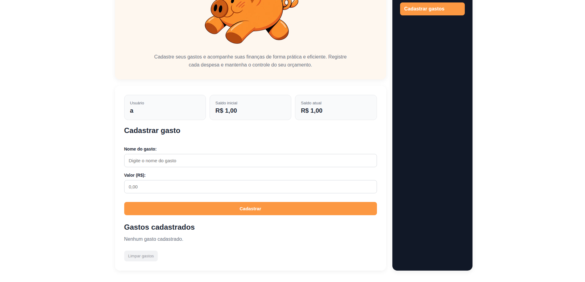

# 🐷 Seu Porquinho Digital

Aplicação web simples de controle financeiro pessoal. Você informa quanto dinheiro tem disponível, cadastra seus gastos e acompanha o saldo atual, com um aviso quando o orçamento é ultrapassado.

Projeto desenvolvido em grupo para a disciplina **[INTRODUÇÃO A PROGRAMAÇÃO]**, no **[INSTITUTO FEDERAL DO RIO GRANDE DO NORTE - CAMPUS NOVA CRUZ]**.




## Funcionalidades

- Cadastro inicial com nome de usuário e dinheiro disponível
- Cadastro de gastos (nome e valor), com o saldo atual atualizado na hora
- Aviso em vermelho, mostrando quanto passou do orçamento, quando o saldo fica negativo
- Remoção de gastos individualmente ou de todos de uma vez (com confirmação)
- Os dados ficam salvos no navegador: ao recarregar a página, nada se perde
- Valores exibidos no formato brasileiro (R$ 1.234,56)
- Layout responsivo (computador e celular) e navegação por teclado

## Tecnologias

HTML5, CSS3 e JavaScript puro (sem frameworks e sem dependências).

## Como executar

Não precisa instalar nada:

1. Baixe ou clone este repositório.
2. Abra o arquivo `index.html` no navegador.

Para publicar online de graça, use o **GitHub Pages**: em *Settings → Pages*, escolha a branch `main` e a pasta `/ (root)`.

## Estrutura do projeto

```
seu-porquinho-digital/
├── index.html     # Página inicial (nome e dinheiro disponível)
├── gastos.html    # Página de cadastro e lista de gastos
├── script.js      # Lógica das duas páginas
├── style.css      # Estilos
├── imagens/       # Logos e ícones
└── docs/          # Documentos relaciona ao site
```

## Como os dados são guardados

Tudo é salvo no `localStorage` do navegador, em uma única chave (`porquinhoDigital`). Isso significa que:

- os dados ficam **somente no seu navegador e neste dispositivo**, nada é enviado a servidor algum;
- limpar os dados do navegador apaga o controle financeiro;
- começar um novo controle pela página inicial substitui o anterior.

Os valores em dinheiro são armazenados em **centavos** (números inteiros) para evitar erros de arredondamento do JavaScript.

## Equipe

- [José Gabriel da Rocha Coutinho]
- [Cícero Romão de Oliveira Mendonça]
- [José Arlindo Xixiu da Silva]
- [Ana Alice Alves Bezerra]

Orientação: [Aislan Galdino da Cunha]

## Licença

Distribuído sob a licença MIT. Veja o arquivo [LICENSE](LICENSE) para mais detalhes.
